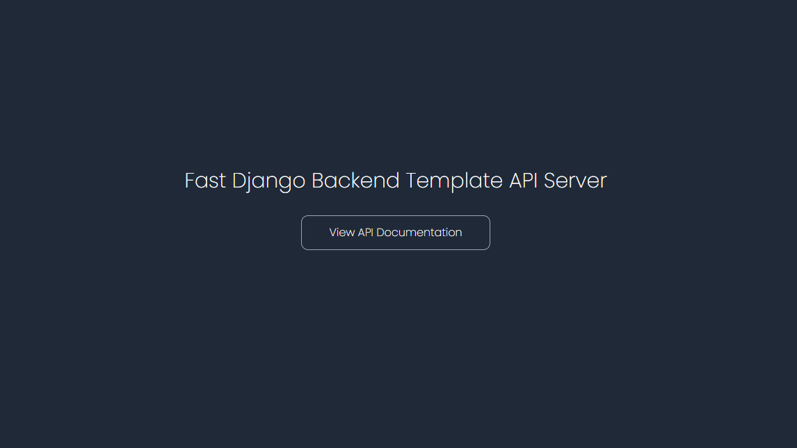

# fast-django-backend-template.

A specially customized, and highly flexible Python Django(with the Django Ninja framework) template, for easily bootstrapping Django projects, and building super-fast backends/servers. Built with so much love for myself, and engineering teams that I lead/work on.

The template is domain-driven-development(DDD)-inspired, and will have 3 default/sample domains to demonstrate the beautiful modular standard it follows.

> The template will as well support work on 3 different environments(development/dev, staging, and production) - with modularized settings and environment variable files for each. 

**The template also has a multi-database scope - hence will have configurations for multiple databases(Sqlite, and PostgreSQL for now)**. More on that below.

## About the Django Ninja Framework

Django Ninja is a fast, modern web framework built on top of Django and powered by Python type hints. It is designed to create high-performance APIs quickly and with minimal code. If you're familiar with Django and want to build APIs without the complexity of Django REST Framework, Django Ninja is a lightweight and expressive alternative.

### Why Choose Django Ninja?

- Built on Django – Fully compatible with Django’s ORM, views, models, authentication, and middleware.

- High Performance – As fast as FastAPI thanks to Starlette and Pydantic under the hood.

- Automatic Validation – Uses Pydantic for request and response data validation with full type hint support.

- Auto-generated API Docs – Comes with built-in OpenAPI and Swagger UI documentation.

- Simple & Intuitive – Less boilerplate, more productivity. Great for building clean and maintainable APIs.

> Django Ninja is heavily inspired by **FastAPI** and shares several core concepts, but it's built to work seamlessly within the Django ecosystem.

## How To Use This Template.

1. Using this template is simple. The main criteria being that you know how to use Python, the Django Python Framework and the Django-Ninja framework. And also that you have Docker installed on your machine.

2. Create a virtual environment.

```shell
python -m venv env
```

3. Activate the virtual environment.

> windows:

```shell
source env/Scripts/activate
```

> linux/mac:

```shell
source venv/bin/activate
```

4. Check and ensure that the desired/created virtual environment is what you are currently logged on(especially in a case where the dependencies seem not to be getting installed or if they seem not to be reflecting in the requirements file after installation - even after running `pip freeze > requirements.txt`).

```shell
which python
```

5. Proceed to install all project dependencies.

with current project versions:

```bash
pip install -r requirements.txt
```

or, with new version installations(ensure to delete the `requirement.txt` file first):

```bash
pip install Django django-ninja python-dotenv # in progress
```

6. Update the current requirements.txt file - if/when necessary.

```shell
pip freeze > requirements.txt
```

7. Start the server.

```bash
python manage.py runserver
```

You should see a welcome screen like the one below:



The welcome screen is simply a Django template setup I built - TailwindCSS was used for styling.

> **As at my last update, the template is complete enough to help bootstrap your project and give you a massive leap into development. It currently supports only Sqlite. No Docker and PostgreSQL for now, just straight-up with Sqlite.**

8. Explore your project and test the following domain end-points.

```bash
.../api/v1/auth/
```

```bash
.../api/v1/user/
```

```bash
.../api/v1/admin/
```

9. Ride/speed on...

## Docker And Docker Compose Setup.

...in progress.

## Enforcing Coding(Contribution) Standards/Rules(Linting, Code Formatting, and more).

...in progress.

## Database Setup.

...in progress.

## Writing Tests.

...in progress.

## CI/CD Support With Jenkins.

...in progress.